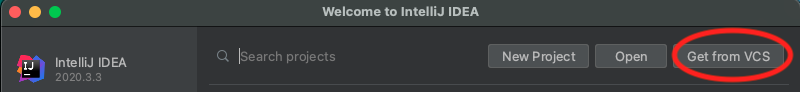

# Setup test SDP
This repository contains a simple example that enables you to test if the **IntelliJ** IDE works correctly. 

* You can import the project directly from a *Version Control System*, by providing the following URL: 
https://ewserver.di.unimi.it/gitlab/riccardopresotto/setup_test_sdp.git

* Otherwise, take care to import the project as a Gradle Project

* If required, trust the project and accept the Gradle auto-import
 
* Wait until the Gradle indexing process ends (it may take a few seconds)

* The testing files are located in the directory: *setup\_test\_sdp/src/main/java*

